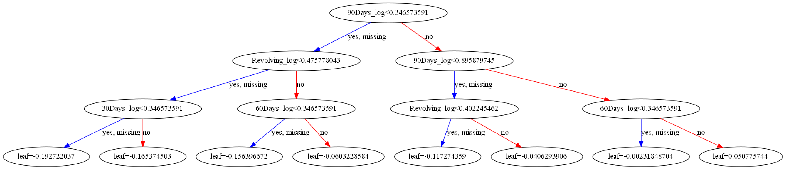
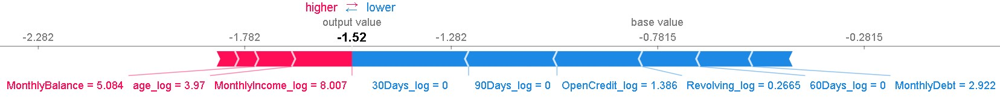

# Loan Default Prediction using XGBoost with explainability

<b>Language</b>  
Python

<b>Introduction</b>  
Exploratory Data Analysis (EDA) for a loan dataset by looking for patterns characterizing financial distress. 
Feature importance, feature selection and explainability in loan defaults.

<b>Dataset</b>  
Give Me Some Credit from Kaggle’s 2012 competition

  

 

  

